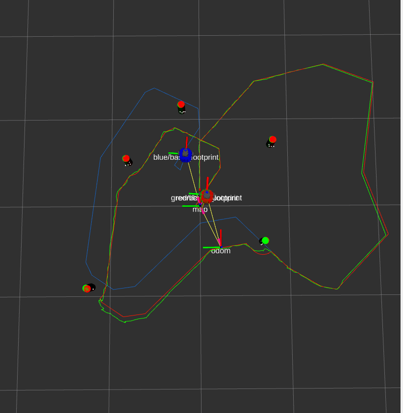

-----------------------------------------------------------------
## Overview
A full EKF SLAM pipeline on a TurtleBot3, implemented **entirely from scratch** in C++ and ROS 2 — no nav-stack or third-party SLAM libraries. This includes a custom 2D rigid-body transform library, differential-drive kinematics, forward/inverse velocity computation, odometry, an Extended Kalman Filter for SLAM, laser-scan clustering, circle fitting, and data association.

The project spans four ROS 2 packages:

| Package | Purpose |
|---------|---------|
| **turtlelib** | From-scratch 2D geometry, diff-drive kinematics and odometry library |
| **nuturtle_description** | Custom URDF for multi-robot visualisation in Rviz |
| **nusim** | Simulator with obstacles, walls, fake encoders and lidar |
| **nuturtle_control** | Velocity command interface for real and simulated robots |
| **nuslam** | EKF SLAM, landmark detection and data association |

-----------------------------------------------------------------
## EKF SLAM

The EKF jointly estimates the robot pose $(x, y, \theta)$ and all landmark positions. Wheel odometry drives the prediction step and landmark observations drive the correction step, producing a map-to-odom transform that compensates for odometry drift.

In Rviz:
- **Red robot** — ground truth (simulation only)
- **Blue robot** — dead-reckoning (odometry only, no corrections)
- **Green robot** — EKF SLAM corrected estimate

-----------------------------------------------------------------
## Landmark Detection

Landmarks are detected from raw lidar scans through a pipeline that is also written from scratch:

1. **Clustering** — adjacent scan points are grouped using an adaptive distance threshold, with wrap-around handling for the first and last clusters.
2. **Circle fitting** — each cluster is fit to a circle using a least-squares algebraic fit, rejecting clusters whose radius falls outside an expected range.
3. **Data association** — detected circles are matched to existing landmarks in the EKF state via Mahalanobis distance; unmatched detections initialise new landmarks.

-----------------------------------------------------------------
## SLAM with Unknown Data Association (Simulation)

<video src="https://github.com/user-attachments/assets/5b7cc019-d11e-46c1-8c6c-013334f48393" width="100%" controls autoplay loop muted playsinline></video>

The green robot (EKF SLAM) tracks the red ground truth closely while the blue robot (odometry) drifts. Cyan cylinders are circle-fit detections from the lidar and green cylinders are the associated landmarks maintained by the filter.

-----------------------------------------------------------------
## EKF SLAM on the Real TurtleBot

<video src="https://github.com/user-attachments/assets/7874e308-e9df-4493-a536-bdb8ba333017" width="100%" controls autoplay loop muted playsinline></video>

Running on the physical TurtleBot3 with real lidar data. The blue robot accumulates odometry drift while the green robot corrects its pose using landmark observations from the environment.

-----------------------------------------------------------------
## Acknowledgements

This project was developed as part of **ME495: Sensing, Navigation and Machine Learning for Robotics** at Northwestern University, under the instruction of **Professor Matthew Elwin**.
