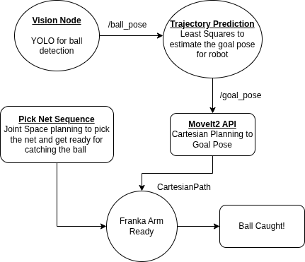

-------------------------------------------------------------------------
## Overview
This project develops a **vision-based object detection and interception system** using a **Franka Emika Panda robotic arm**.An external camera tracks a moving ball in real time, while a trajectory prediction module estimates its future position and guides the robot to intercept and catch the ball. The system integrates perception, prediction, and control to enable autonomous, dynamic manipulation in a very short time of ~**`1s.`**

The major complexities in the system are :
 - A short time of flight of the ball
 - A limited field of view of the camera.
 - High speed movement of the robot without hitting joint limits.

-------------------------------------------------------------------------
 ## System Components

| Component | Description |
|-----------|-------------|
| **Robot** | Franka Emika Panda 7-DOF robot arm |
| **Camera** | Realsense camera D455 |
| **Middleware** | ROS2 |
| **Calibration** | eye-on-base with easy_handeye2 package|
| **Vision** | OpenCV/YOLO implementation for ball detection|
| **Motion Planning** | MoveIt 2 API for Cartesian and Joint-space planning|
| **Trajectory Prediction** | Least Squares with Median Absolute Deviation (outlier rejection)|
| **Catch equipment** | 3D-printed hoop with fish net|

-------------------------------------------------------------------------
## Architechture

-------------------------------------------------------------------------
## Calibration Pipeline

The system uses an external camera mounted behind the robot arm, giving it a wide field of view without interfering with the robot’s workspace. The calibration process works as follows:

- An ArUco marker is attached to the end-effector of the Franka Emika Panda arm.  
- Using the MoveIt 2 API in RViz, the robot is manually guided close to the camera.  
- A custom calibration node is launched, and the arm is moved through multiple poses so the camera can observe the marker from different viewpoints.  
- After collecting ~15 valid measurements, the pipeline computes the extrinsic calibration, producing a fixed transform between the robot’s base frame and the camera’s camera_link frame.

This calibrated transform enables accurate robot–camera frame alignment for perception and manipulation tasks.

-----------------------------------------------------------------------------
## Vision Pipeline

The vision pipeline is responsible for detecting the ball and estimating its 3D position in real time.

### Data Collection and Training
- Multiple rosbags were recorded by throwing the ball in different trajectories and conditions.  
- The collected data was labeled and used to train a **YOLO** object detection model using **Roboflow**.  
- The trained model weights are loaded by the vision node at runtime.

### Ball Detection
- The vision node subscribes to the camera **`image_raw` topic** and runs YOLO inference on incoming frames.  
- When the ball is detected, its 2D image coordinates are extracted from the bounding box output.

### 3D Pose Estimation
- Using the camera’s depth info, the ball’s 2D detection is projected into 3D space.  
- The resulting 3D position is then obtained in the camera frame.

### ROS 2 Integration
- The `ball` frame is added to the `tf_tree` and this way the `base--ball` transform can now be looked up. The pose of the ball is also published on `ball_pose` topic for rviz.

---------------------------------------------------------------------------------------
## Trajectory Prediction

The trajectory prediction module estimates the ball’s future motion and computes a reachable intercept pose for the robot.

### Parabolic Trajectory Fitting
- The system looks up the **TF transform** between the robot **base frame** and the detected **ball frame**.  
- Using the first few in-flight ball measurements (a parameter tuned through experimentation), a **Least Squares** method is used to fit a 3D **parabolic trajectory**.  
- **Median Absolute Deviation (MAD)** is applied for **outlier rejection**, improving robustness to noisy detections.  
- From the fitted trajectory, an intercept **goal_pose** with a fixed plane in the robot workspace is estimated and published to a `goal_pose` topic and added to the `tf_tree` as a frame for visualization in rviz.

### End-Effector Alignment Optimization
- Initially, the robot was sent directly to the goal pose with a fixed x-axis offset to account for the net position, which led to consistent small errors.  
- To improve accuracy, we leveraged the robot’s *end-effector rotation*, which has high freedom of motion.  
- In the goal_pose frame, the vector offset between the **net center** and the **end-effector** was estimated.  
- The final end-effector position was computed to allow a compensating **rotation**, rather than a fixed translation.

This adjustment significantly increased the **catch success rate** by better exploiting the robot’s kinematic flexibility.

------------------------------------------------------------------------------------------
## Robot Control

The robot control module executes the catch once a valid intercept pose is available.

### Initial Configuration
- The robot starts in a ready pose, holding the net in a fixed plane defined by a configurable z-axis height.  

### Goal Pose and Planning
- The predicted goal pose is computed as the intersection of the ball’s parabolic trajectory with the predefined plane.  
- Since both the start pose and goal pose lie on this plane, the system uses Cartesian path planning for the end-effector.  
- Cartesian planning is preferred over joint-space planning as it is faster and more reliable for short, constrained motions.

### Execution and Control
- The catcher node continuously listens to the **`/goal_pose`** topic.  
- Upon receiving a valid goal pose, it immediately commands the robot to move to the target.  
- Velocity scaling and acceleration scaling are set to **0.9** to achieve high-speed, responsive motion required for catching.

This control strategy enables rapid and precise execution during the ball’s flight time.

----------------------------------------------------------------------------------------
## Key Challenges Solved

- Robust ball detection using YOLOv11.  
- Accurate trajectory prediction using Least Squares with MAD outlier rejection.  
- Increased catch success using end-effector rotation for alignment.  
- Fast and precise motion via Cartesian path planning on a fixed z-plane.  
- Real-time integration of vision, prediction, and control in ROS.

------------------------------------------------------------------------------------------
## Contribution

- Integrated the *calibration pipeline* with the robot and camera system.  
- Configured and set up the *vision pipeline* within ROS (excluding YOLO model training).  
- Developed the *ROS infrastructure* and modular launch files for *end-to-end testing*, enabling faster development and iteration cycles.  
- Responsible for *code cleanup*, refactoring, and improving maintainability across the project.
-------------------------------------------------------------------------------------------
## Acknowledgements
This project was developed as a final project for **ME495: Embedded Systems in Robotics** at Northwestern University, under the instruction of **Professor Matthew Elwin**. It was completed collaboratively with **Anunth Ramaswami**, **Kyle Thompson**, and **Zixin Ye**, whose teamwork and technical contributions were essential to the project’s success.

The project emphasizes real-world robotic system design, highlighting the gap between idealized simulation and physical execution.
