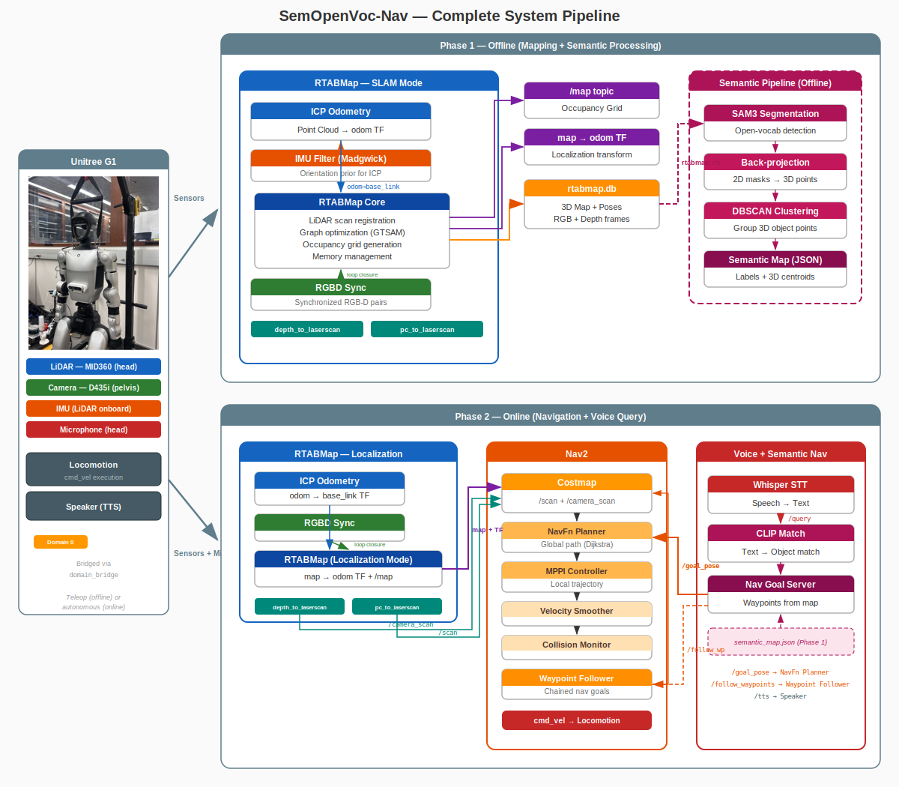
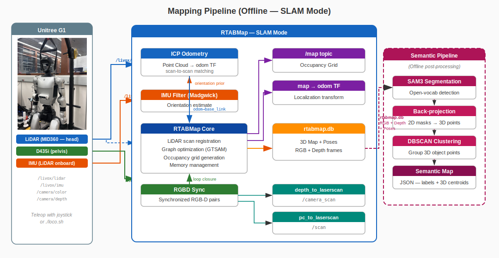
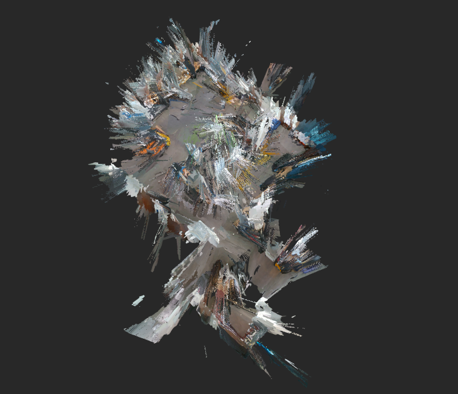
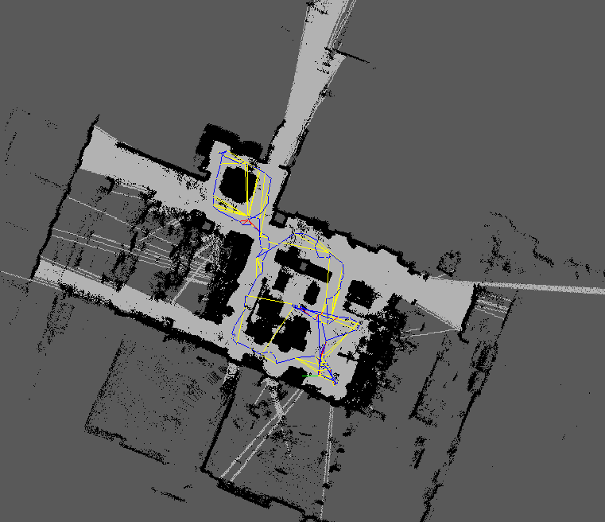
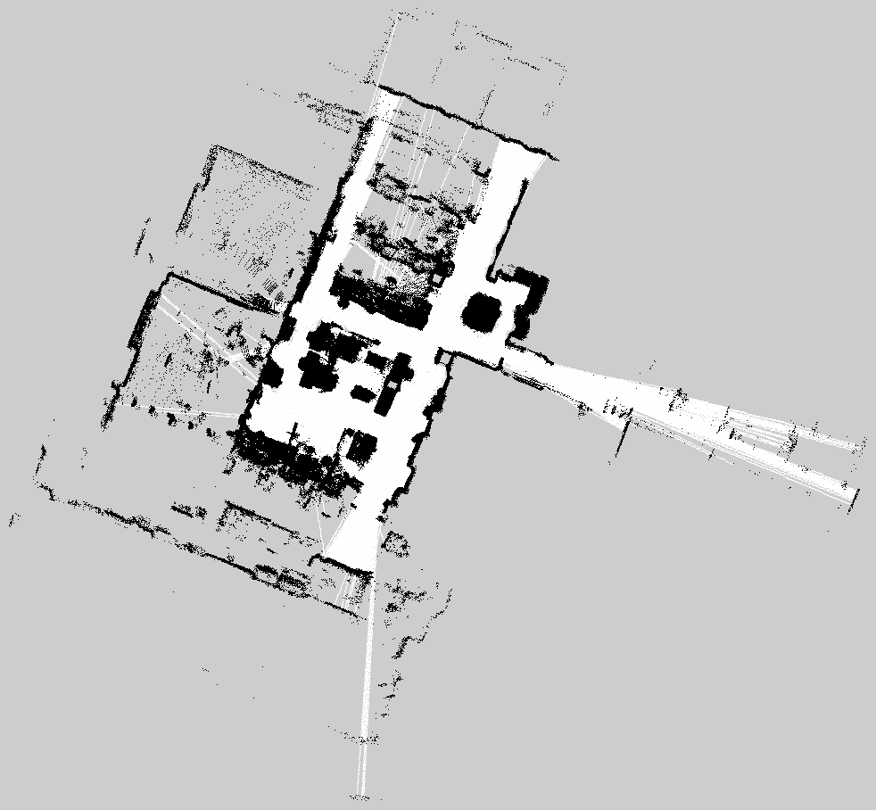
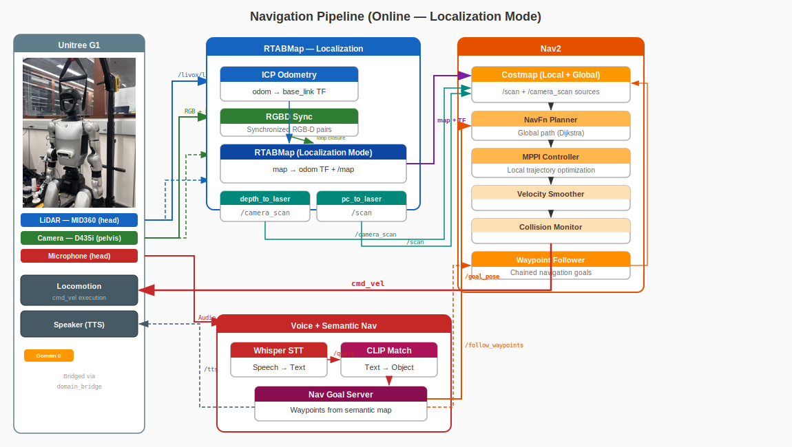

-------------------------------------------------------------------------
## Motivation

Humans navigate indoor spaces not by following coordinates or occupancy grids, but through a semantic understanding of their surroundings. We walk toward *"the fridge"* or *"the whiteboard"*, and we communicate these intentions through natural language — not waypoints. This kind of navigation is effortless for us: we build a mental map of meaningful objects and use open-ended vocabulary to refer to them, even objects we haven't seen before.

Robots, on the other hand, typically navigate in a purely geometric world — a 2D grid of free and occupied cells with no notion of *what* occupies them. SemOpenVoc-Nav is an attempt to close this gap: giving a humanoid robot the ability to understand its environment semantically and respond to natural language commands like *"check the fridge and then throw the trash away."*

-------------------------------------------------------------------------
## Overview

This project implements a full semantic navigation pipeline on the Unitree G1 humanoid robot. The system combines:

- SLAM-based 3D mapping using RTABMap with lidar and RGB-D sensors
- Open-vocabulary object detection using SAM3 for segmentation and CLIP for language grounding
- Voice interaction using Whisper for speech-to-text on the robot's microphone
- Autonomous navigation using Nav2, adapted for humanoid locomotion

The robot first builds a geometric map of the environment via teleoperated walking. A semantic pipeline then extracts and localizes objects of interest from the map using SAM3 segmentation and depth back-projection. At runtime, the user speaks a command — Whisper transcribes it, CLIP matches it to known objects, and Nav2 drives the robot to the target. Chained commands like *"check the fridge and throw trash away"* are automatically split and executed as an ordered waypoint sequence.

Beyond the semantic navigation itself, this project also delivers a complete ROS 2 pipeline for the Unitree G1 — keyboard/joystick teleoperation via `g1_loco_interface`, SLAM with or without lidar using RTABMap, Nav2 integration treating the humanoid as an omnidirectional base, and the full semantic + open-vocabulary layer on top. Together, these form a reusable foundation for any G1-based autonomy work.

-------------------------------------------------------------------------
## Architecture



The system runs across two ROS 2 DDS domains connected by a domain bridge:

- Domain 0 (Robot): The G1 publishes joint states and sensor streams over CycloneDDS. Voice input is captured and processed here.
- Domain 1 (Perception + Navigation): RTABMap, Nav2, semantic reasoning, and all planning nodes run here over FastDDS.

The pipeline has three phases: mapping (build a geometric map via SLAM), semantic extraction (identify and localize objects offline using SAM3 + CLIP + DBSCAN clustering), and navigation (voice command → Whisper transcription → CLIP matching → Nav2 goal execution).

-------------------------------------------------------------------------
## Tech Stack

### Domain Bridge


The Unitree G1's internal SDK communicates over CycloneDDS (Domain 0), while the perception and navigation stack runs on FastDDS (Domain 1). These two DDS implementations are incompatible — nodes on one domain cannot directly discover or communicate with nodes on the other. This separation is critical: running Nav2 or RTABMap on the same DDS domain as the robot's low-level control could cause DDS discovery storms or resource contention that risks crashing the robot's safety-critical locomotion nodes. The `domain_bridge` node sits between the two domains and selectively forwards only the topics that need to cross the boundary.

Topics bridged (Domain 0 → 1): `joint_states`, `tf`, `tf_static`, `robot_description`, `semantic_nav/query`

Topics bridged (Domain 1 → 0): `cmd_vel`, `semantic_nav/tts`

This way, heavy computation (SLAM, planning, semantic reasoning) stays isolated on Domain 1, while Domain 0 remains lightweight and stable for real-time robot control.

### Teleoperation — g1_loco_interface

During the mapping phase the robot needs to be walked through the environment. The `g1_loco_interface` node from the Unitree SDK runs on Domain 0 and accepts keyboard or joystick input, converting it into velocity commands that drive the G1's built-in locomotion controller. A joystick is preferred for smoother trajectories during map building.

### Semantic Mapping & Object Extraction



The robot is teleoperated through the environment while RTABMap performs simultaneous localization and mapping. Two sensor configurations are supported:

- Livox MID360 + D435 (primary): ICP odometry from lidar point clouds, with RGB-D loop closure from the camera.
- D435 only (fallback): Visual odometry from infrared stereo when the lidar is unavailable.

Both configurations use `imu_filter_madgwick` for IMU orientation estimation and `depthimage_to_laserscan` to convert depth images into LaserScan messages for Nav2's costmap.

RTABMap produces a 3D point cloud and a projected 2D occupancy grid:

<div style="display: flex; gap: 16px; justify-content: center; flex-wrap: wrap;">
  
  
</div>

The raw 2D grid map was refined offline using GIMP to remove noise and stray artifacts before being used by Nav2 for path planning:

<div style="display: flex; justify-content: center;">
  
</div>

Once the map is complete, the semantic pipeline processes RTABMap's database offline. First, `rtabmap-export` extracts all stored RGB frames, depth frames (16-bit PNG in mm), camera poses (as 4×4 transformation matrices from quaternion + translation), and camera intrinsics from the database. Each RGB frame is then sent to a SAM3 segmentation server — a FastAPI service running on a GPU-equipped machine — with the target object labels (e.g. "white fridge", "blue trash can") as text prompts. SAM3 returns per-object binary masks along with confidence scores.

For each detected mask, the corresponding depth image is used to back-project masked pixels into 3D. Given a pixel $(u, v)$ with depth $d$ and camera intrinsics $(f_x, f_y, c_x, c_y)$, the 3D point in the camera frame is recovered via the pinhole model:

$$X_c = \frac{(u - c_x) \cdot d}{f_x}, \quad Y_c = \frac{(v - c_y) \cdot d}{f_y}, \quad Z_c = d$$

The camera pose $T_{map}^{cam} \in SE(3)$ then transforms each point into the map frame:

$$\mathbf{p}\_{map} = T\_{map}^{cam} \begin{bmatrix} X_c \\\\ Y_c \\\\ Z_c \\\\ 1 \end{bmatrix}$$

Since the same object appears across many frames from different viewpoints, detections are accumulated and then merged using DBSCAN clustering ($\epsilon = 0.5m$, $\text{min\\_samples} = 2$). The largest cluster's median is taken as the final centroid for each object — median rather than mean for robustness to outliers. The result is saved as a JSON semantic map mapping each object label to its 3D centroid.

### Open-Vocabulary Navigation



Nav2 runs on Domain 1 with the following pipeline:

```
controller_server (MPPI) → cmd_vel_nav → velocity_smoother → cmd_vel_smoothed → collision_monitor → cmd_vel
```

- Global planner: NavFn (Dijkstra)
- Local controller: MPPI (omnidirectional)
- Costmap: Dual observation sources — `/scan` (lidar) and `/camera_scan` (depth-derived)
- Collision monitor: Stops the robot if obstacles are detected in `/scan` or `/camera_scan`

At runtime, the user speaks into the G1's microphone, triggering the `voice_query` ROS service. The node receives raw PCM audio over multicast UDP from the G1's onboard mic (16-bit, 16kHz mono), writes it to a temporary WAV file, and runs Whisper to transcribe it into text. The transcription is published to `/semantic_nav/query`.

The `nav_goal_server` node picks up the query and uses CLIP (`clip-vit-base-patch32`) for open-vocabulary matching. At startup, it precomputes L2-normalized text embeddings for every object name in the semantic map. Let $\mathbf{e}_q$ be the embedding of the incoming query and $\\{\mathbf{e}_1, \dots, \mathbf{e}_n\\}$ the precomputed object embeddings. The best match is selected by cosine similarity:

$$i^* = \arg\max_i \frac{\mathbf{e}_q \cdot \mathbf{e}_i}{\|\mathbf{e}_q\| \, \|\mathbf{e}_i\|}$$

If the score $\text{sim}(i^*) > 0.70$, the corresponding object's centroid is converted into a Nav2 goal pose.

For chained commands (e.g. *"check the fridge and throw trash away"*), the query is split on conjunctions ("and", "then", "and then", "after that") using regex. Each segment is CLIP-matched independently, and the matching objects are sent as an ordered waypoint sequence via Nav2's `FollowWaypoints` action.

The same `/semantic_nav/query` topic also accepts text published directly — so queries can be tested without voice using:
```
ros2 topic pub /semantic_nav/query std_msgs/String "data: 'go to the fridge'" --once
```

-------------------------------------------------------------------------
## Custom Hardware

<div style="display: flex; gap: 16px; justify-content: center; flex-wrap: wrap;">
  <video src="https://github.com/user-attachments/assets/3bfe8637-964e-4883-a35b-d29628a8f79c" width="360" height="280" autoplay loop muted playsinline></video>
  <video src="https://github.com/user-attachments/assets/7f2431ab-0111-4e56-a8be-3f95364fa8f1" width="360" height="280" autoplay loop muted playsinline></video>
</div>

- Anti-Slip Shoes: 3D printed TPU anti-slip shoes for the G1 to improve traction on smooth indoor floors and reduce noise. Printed from [this MakerWorld model](https://makerworld.com/en/models/1692807-unitree-g1-anti-slip-shoes#profileId-1794538).
- Camera Mount: Custom-designed pelvis mount for the Intel D435 depth camera. Designed by Nolan.

-------------------------------------------------------------------------
## Acknowledgements
This project was developed as a Winter independent project at Northwestern University as part of the MS in Robotics program. Thanks to Prof. Matthew Elwin for his mentorship and guidance throughout the project. Thanks to Nolan for designing the camera mount, and to Chenyu, Andnet, Daniel, and Saif for their help with recording videos and mapping sessions.

-------------------------------------------------------------------------
## Future Work

- Autonomous Exploration with VLA + RL: I attempted to deploy [NaVILA](https://navila-bot.github.io/) using the provided pretrained weights for vision-language-action based navigation, but the results were not reliable enough for deployment. A next step would be to fine-tune the VLA model and combine it with visuo-proprioceptive RL locomotion policies to enable fully autonomous mapping without teleop.
- Manipulation and Whole-Body Control: This project focused on navigation and semantic understanding. The natural extension is to add manipulation and whole-body control so the robot can perform meaningful tasks at the goal location — e.g. opening the fridge or picking up trash — thus closing the loop from language command to physical action.

-------------------------------------------------------------------------
## Citations

1. M. Labbé and F. Michaud, "RTAB-Map as an Open-Source Lidar and Visual SLAM Library for Large-Scale and Long-Term Online Operation," *Journal of Field Robotics*, vol. 36, no. 2, pp. 416–446, 2019. [Paper](https://onlinelibrary.wiley.com/doi/abs/10.1002/rob.21831)

2. N. Carion et al., "SAM 3: Segment Anything with Concepts," *arXiv preprint arXiv:2511.16719*, 2025. [Paper](https://arxiv.org/abs/2511.16719)

3. A.-C. Cheng, Y. Ji, Z. Yang, Z. Gongye, X. Zou, J. Kautz, E. Biyik, H. Yin, S. Liu, and X. Wang, "NaVILA: Legged Robot Vision-Language-Action Model for Navigation," *RSS*, 2025. [Paper](https://arxiv.org/abs/2412.04453)

4. A. Radford, J. W. Kim, C. Hallacy, A. Ramesh, G. Goh, S. Agarwal, G. Sastry, A. Askell, P. Mishkin, J. Clark, G. Krueger, and I. Sutskever, "Learning Transferable Visual Models From Natural Language Supervision," *ICML*, 2021. [Paper](https://arxiv.org/abs/2103.00020)

5. A. Radford, J. W. Kim, T. Xu, G. Brockman, C. McLeavey, and I. Sutskever, "Robust Speech Recognition via Large-Scale Weak Supervision," *ICML*, 2023. [Paper](https://arxiv.org/abs/2212.04356)

6. G. Clifford, "Localizing and Navigating in Semantic Maps Created by an iPhone," 2024. [Project](https://graham-clifford.com/Localizing-and-Navigating-in-Semantic-Maps-Created-by-an-iPhone/)
