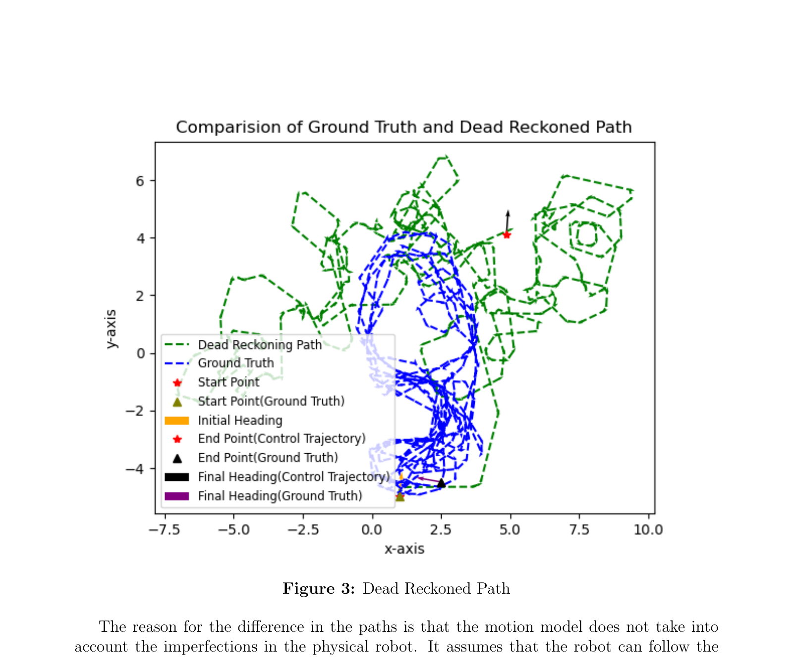
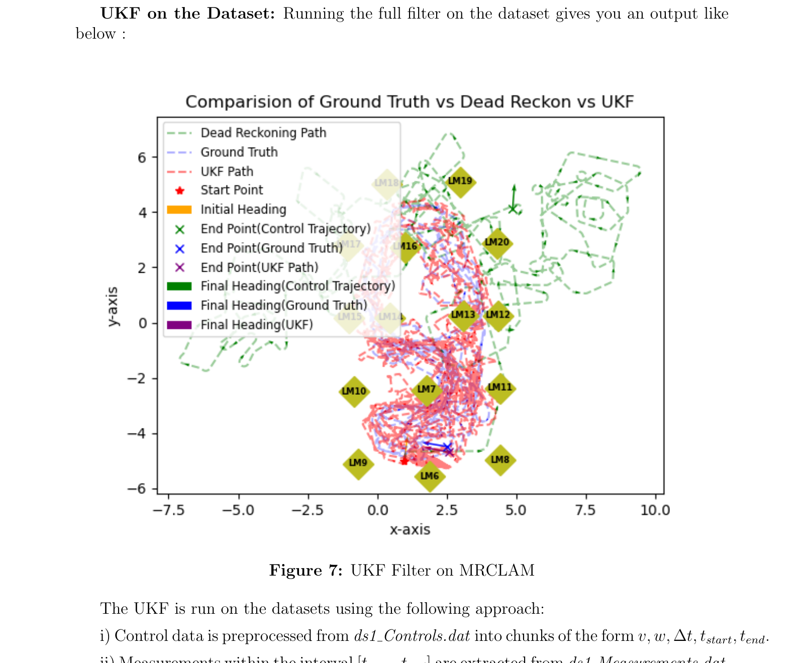
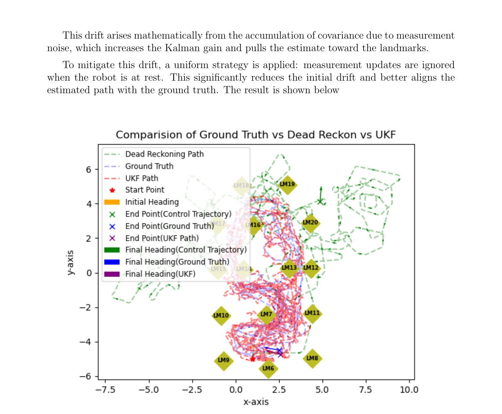

-------------------------------------------------------------------------
## Overview
This project implements an **Unscented Kalman Filter (UKF)** for state estimation of a mobile robot operating in a 2D plane. The robot's state is represented as $(x, y, \theta)$ and is estimated by fusing **odometry control commands** with **range-bearing measurements** to known landmarks. The implementation is tested on the **MRCLAM (Multi-Robot Cooperative Localization and Mapping)** dataset from the University of Toronto's Autonomous Space Robotics Lab.

The core challenge addressed here is that **dead reckoning alone** causes the estimated path to diverge significantly from reality due to accumulated odometry errors. By incorporating landmark measurements through the UKF, the corrected trajectory closely follows the ground truth.

-------------------------------------------------------------------------
## The Problem: Odometry Drift

A mobile robot using only control commands (linear velocity $v$ and angular velocity $\omega$) to estimate its position will accumulate errors over time. This is because the motion model assumes the robot perfectly follows the commanded velocities, which is never true on a physical robot due to wheel slip, actuator noise, and other imperfections.

*The green path (dead reckoning) diverges significantly from the blue path (ground truth) after just the first few turns, eventually ending up in a completely different location.*

The solution is to fuse the control commands with **landmark observations** — range and bearing measurements to known positions in the environment — using a probabilistic filter.

-------------------------------------------------------------------------
## Why UKF over EKF?

The robot's motion model is **non-linear** due to the $\sin(\theta)$ and $\cos(\theta)$ terms in the unicycle model. While the **Extended Kalman Filter (EKF)** handles non-linearity by linearizing the model via Taylor series expansion, the **Unscented Kalman Filter** takes a fundamentally different approach: it samples a set of deterministic points (called **sigma points**) around the current mean, passes them through the non-linear model directly, and then recovers the transformed distribution from the outputs. This avoids the need for Jacobian computation and generally provides better accuracy for highly non-linear systems.

-------------------------------------------------------------------------
## System Components

| Component | Description |
|-----------|-------------|
| **State Space** | $(x, y, \theta)$ — position and heading of the robot |
| **Motion Model** | Unicycle model with velocity commands $(v, \omega)$ |
| **Measurement Model** | Range and bearing to known landmarks |
| **Dataset** | MRCLAM ds1 — controls, measurements, ground truth, landmark positions |
| **Filter** | Unscented Kalman Filter with configurable $\alpha$, $\beta$, $\kappa$ parameters |

-------------------------------------------------------------------------
## Motion Model

The robot follows the unicycle kinematic model. Given current state $(x_i, y_i, \theta_i)$ and control inputs $(v, \omega)$ applied for duration $\Delta t$:

**When $\omega \neq 0$:**

$$x_f = x_i + \frac{v}{\omega}[\sin(\theta + \omega \Delta t) - \sin(\theta)]$$

$$y_f = y_i - \frac{v}{\omega}[\cos(\theta + \omega \Delta t) - \cos(\theta)]$$

$$\theta_f = \theta_i + \omega \Delta t$$

**When $\omega = 0$ (straight-line motion):**

$$x_f = x_i + v\cos(\theta) \Delta t$$

$$y_f = y_i + v\sin(\theta) \Delta t$$

-------------------------------------------------------------------------
## Measurement Model

The robot observes known landmarks and measures the **range** $r$ and **bearing** $\alpha$ to each:

$$r = \sqrt{(x_l - x_r)^2 + (y_l - y_r)^2}$$

$$\alpha = \text{atan2}(y_l - y_r,\ x_l - x_r) - \theta_r$$

where $(x_r, y_r, \theta_r)$ is the robot's pose and $(x_l, y_l)$ is the landmark position.

-------------------------------------------------------------------------
## UKF Implementation

The filter is implemented in `filter/ukf.py` with the following UKF-specific parameters:

| Parameter | Value | Purpose |
|-----------|-------|---------|
| $\alpha$ | 0.0001 | Controls the spread of sigma points around the mean |
| $\beta$ | 2.0 | Incorporates prior knowledge of the Gaussian distribution |
| $\kappa$ | 0.0 | Secondary scaling factor |

### Sigma Point Generation
The algorithm generates $2n + 1 = 7$ sigma points (for $n = 3$ state dimensions) by shifting the mean along the columns of $\sqrt{(n + \lambda)\Sigma}$, computed via **Cholesky decomposition**. The scaling parameter $\lambda = \alpha^2(n + \kappa) - n$ controls how far the sigma points are spread from the mean.

### Predict Step
Each sigma point is propagated through the non-linear motion model. The predicted mean and covariance are recovered via a **weighted sum** of the transformed points, with process noise $R_t$ added to the covariance.

### Correction Step
The predicted sigma points are passed through the measurement model to obtain expected measurements. The **Kalman Gain** is computed from the cross-covariance between the state and measurement spaces, and the state is updated using the innovation (difference between actual and expected measurement). Angle wrapping is applied throughout to handle the circular nature of heading angles.

-------------------------------------------------------------------------
## Event-Based Sensor Fusion

A key design decision is how to handle the **temporally different** control and measurement data. The raw dataset provides control commands and landmark measurements at different timestamps, so they must be merged into a unified processing sequence.

The `syncControlMeasurement()` method in `data/preProcess.py` builds an **events list** where each entry has the format `(timestamp, eventType, data)`. The logic:

1. Control data from `ds1_Controls.dat` is preprocessed into chunks of $(v, \omega, \Delta t, t_{start}, t_{end})$.
2. For each control chunk, all measurements falling within $[t_{start}, t_{end}]$ are extracted from `ds1_Measurements.dat`.
3. Barcode IDs are mapped to landmark subject numbers (filtering out other robots in the multi-robot dataset).
4. The interleaved sequence of control and measurement events is passed to `runFilter()`.

In the filter's main loop, for each **control event**, a predict step propagates the state forward. For each **measurement event**, a predict step is first applied to account for elapsed time since the last event, followed by a correction step. This ensures that the filter properly handles the asynchronous nature of the sensor data.

-------------------------------------------------------------------------
## Results

### UKF on the MRCLAM Dataset

*The red UKF path tracks the blue ground truth significantly better than the green dead-reckoned path. Landmarks (LM6–LM20) are shown as yellow diamonds across the environment.*

Initially, the dataset contains no control commands but many measurement updates. Processing these through the filter causes large shifts in the estimated position due to accumulated covariance from measurement noise, which increases the Kalman gain and pulls the estimate toward the landmarks. This produces the dense red cluster near LM6 in the figure above.

### Improved Result: Ignoring Measurements at Rest

*By ignoring measurement updates when the robot is stationary, the initial drift is eliminated and the UKF path (red) closely follows the ground truth (blue) throughout the trajectory.*

To mitigate the initial drift, a strategy was applied: **measurement updates are ignored when the robot is at rest** (i.e., before any control commands are received). This significantly reduces the initial position shift and better aligns the estimated path with the ground truth.

-------------------------------------------------------------------------
## Key Insights

- The choice of $\lambda$ greatly affects filter stability. Using $\sqrt{n + \kappa}$ instead of $\sqrt{n + \lambda}$ in the sigma point spread caused the covariance to explode.
- The noise matrices $R_t$ and $Q_t$ are critical design choices. Without prior knowledge of the robot or sensors, small values are assumed and tuned based on filter performance.
- The filter performs well when the initial position is assumed to be accurate (small initial covariance). If the initial covariance is high, uncertainty accumulates over time, resulting in more deviated paths.
- Proper **angle wrapping** is essential throughout — in the innovation, covariance recovery, and state update — to avoid discontinuities at the $\pm\pi$ boundary.

-------------------------------------------------------------------------
## Acknowledgements
This project was developed as part of **ME469: Machine Learning and Artificial Intelligence in Robotics** at Northwestern University, under the instruction of **Professor Brenna Argall**. The implementation uses the MRCLAM dataset from the University of Toronto's Autonomous Space Robotics Lab.
