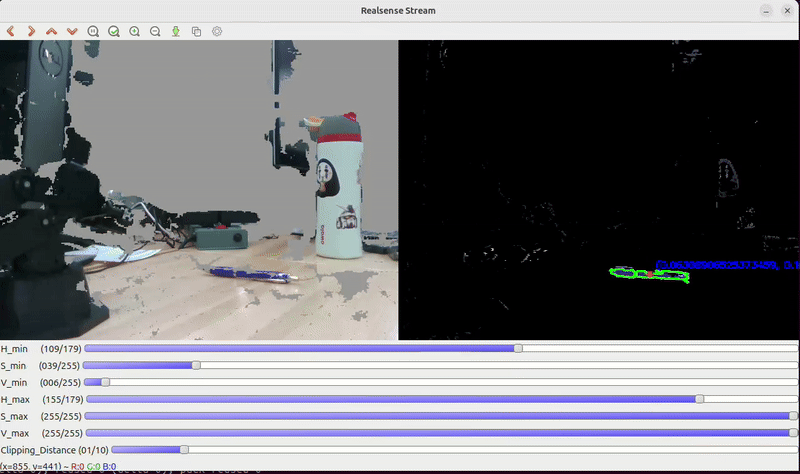

-----------------------------------------------------------------
## Overview
This project focuses on developing a **vision-based grasping system** that detects a coloured pen using a realsense camera, computes the centroid of the pen and commands the robot to grasp the pen using a sequence of actions via a Python API.
The project integrates RGB-D sensing, coordinate transformation, and motion control, serving as a miniature demonstration of visual servoing and object grasping for robotic manipulation.

-----------------------------------------------------------------
## System Components

| Component | Description |
|-----------|-------------|
| **Robot** | Interbotix Pincher-X |
| **Camera** | Realsense camera D435i |
| **Vision** | OpenCV Contour Detection|
| **Motion Planning** | Python API from Interbotix|
| **Calibration** | Kabsch algorithm|

-----------------------------------------------------------------
## High-level Workflow

- Acquire the RGB-D frames and camera info from realsense.
- OpenCV based contour detection for purple pen.
- Extrinsic calibration between robot and camera.
- Estimation of 3D pose of pen with respect to base of robot.
- Motion control of the robot arm.

------------------------------------------------------------------
## Image Acquistion

- The realsense python library is used to get the rgb and depth images.
- The two frames of RGB and depth are aligned to get pixel-level depth correspondance.
- The depth is clipped at 1 meter.

-----------------------------------------------------------------
## Colour Detection

- RGB image is converted to the HSV space.
- OpenCV image processing pipeline is setup with track bars to adjust HSV values for purple detection.
- Gaussian blur is applied for a smooth segmentation.
- A binary mask is generated to isolate the purple colour contours.

------------------------------------------------------------------
## Contour Detection and Centroid Estimate

- Contour Detection is applied to obtain the largest purple coloured area in the image.
- Centroid of the contour is obtained in the pixel co-ordinates.
- 3D co-ordinates of the centroid are obtained using the depth image from the camera.

------------------------------------------------------------------
## Calibration 

The transform between the camera and robot base is unknown and this is required for the robot to be able to grab the pen.
Following steps are taken to obtain the calibration:

- Pen is placed in the end-affector of the robot-arm.
- The robot arm is moved to predefined poses, yielding a known `base → pen` transform.
- At each pose the 3D pose of pen w.r.t camera is obtained , i.e. `camera → pen ` transform.
- Thus, `base → camera` can be obtained by averaging the transforms over all observations.

------------------------------------------------------------------
## Motion Control

After all the above steps, the pen is placed infront of the camera and within reach of the robot.

- 3D position of pen in the base frame of the robot is obtained.
- Commands are sent to the robot arm using the Python API.
- Robot executes the command and grabs the pen!

Hurray!

------------------------------------------------------------------
## Acknowledgements

This project was developed as a part of the **MSR Hackathon** under the guidance of **Professor Matthew Elwin**.
His mentorship and resources provided us with the techincal depth and breadth required to complete the project.
I am also thankful to all the cohort members of the **MS in Robotics program** for a collaborative and fun project!